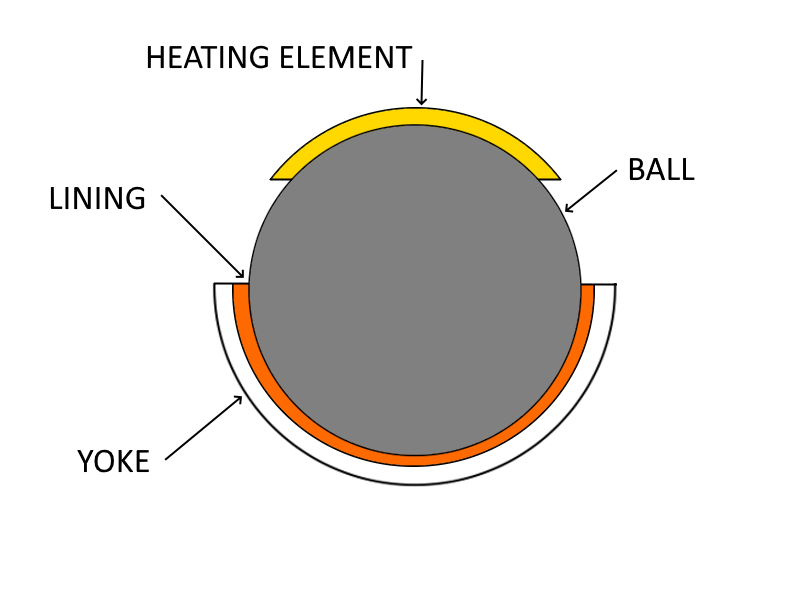
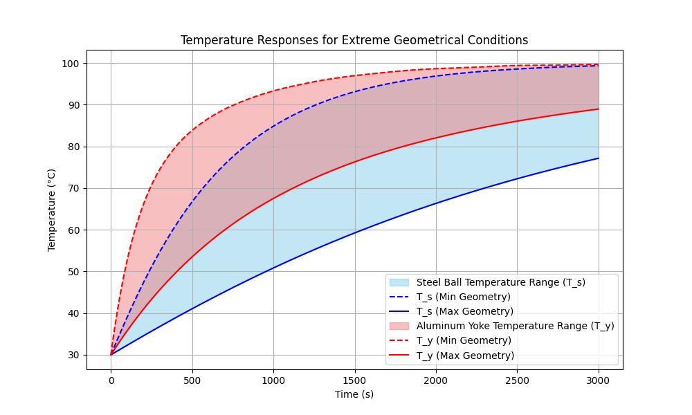
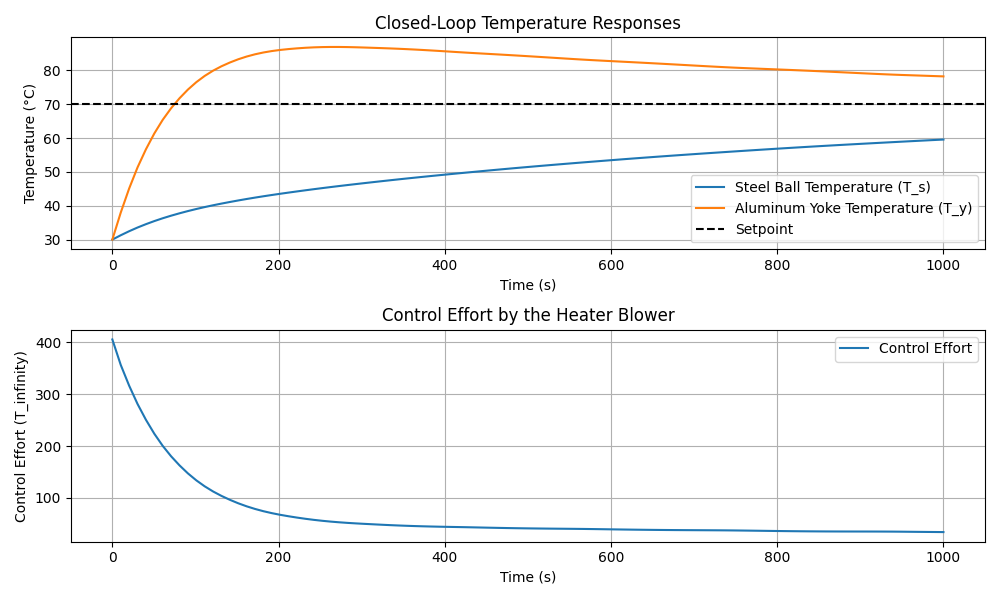
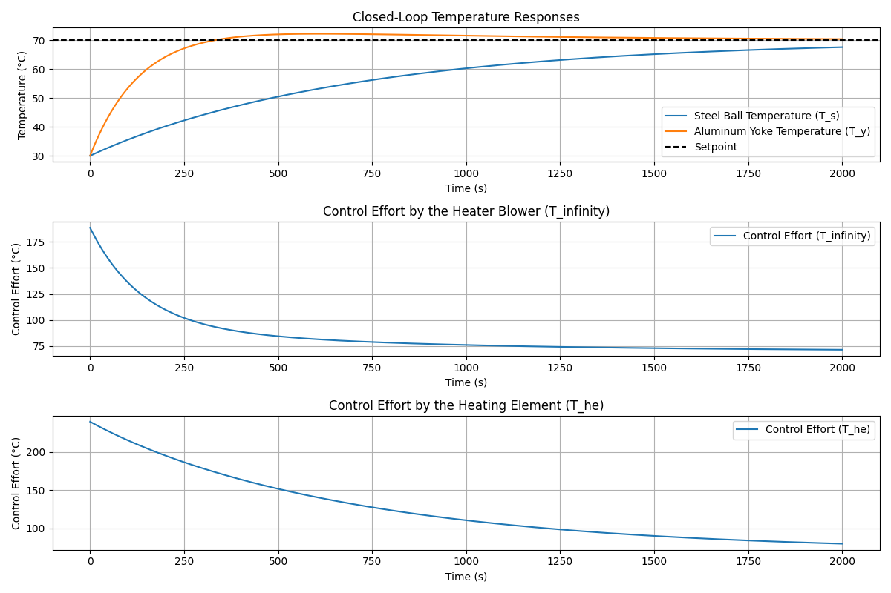

# Heat Transfer Dynamics Control Problem

In closed loop temperature control, often there is one measured sample of interest which is being actively monitored in order to close the loop around a target setpoint using some kind of heating actuation.

The problem becomes a bit more complicated when coupled with multiple material samples which are to be monitored and feature independent setpoint targets.

This repository contains the model for the heat transfer dynamics between a steel ball and an aluminum yoke (container/bowl) which houses the ball with a rubber silicone lining. The system includes a heater blower providing convective heat transfer and direct contact between the two objects providing conductive heat transfer through the rubber silicone lining.



The above figure shows the problem geometry, including a steel ball, an aluminum yoke, a rubber silicone lining, and a heating element which is only considered later one with the introduction of a secondary input heating source. Assume the system is exposed to forced air convection from an external input source.

## Geometric Parameters

### Steel Ball
- **Outer radius ($R_s$)**: 25mm to 100mm
- **Inner radius ($r_s$)**: 0mm to $\frac{R_s}{2}$ (for a hollow ball)
- **Volume ($V_s $)**:
```math
  V_s = \frac{4}{3} \pi (R_s^3 - r_s^3)
```
- **Surface area (for convection, $A_{conv,s}$)**:
```math
  A_{conv,s} = 2 \pi R_s^2
```

### Aluminum Yoke (Bowl)
- **Radial thickness ($t $)**: Varying from 5mm to 25mm
- **Inner diameter**: $R_s$
- **Outer diameter**: $R_s + t$
- **Volume ($V_y $)**:
```math
  V_y = \frac{2}{3} \pi \left((R_s + t)^3 - R_s^3\right)
```
- **Surface area (for convection, $A_{conv_y} $)**:
```math
  A_{conv_y} = 2 \pi (R_s + t)^2
```

### Rubber Silicone Lining
- **Thickness**: 5mm
- **Thermal conductivity ($k_{\text{rubber}} $)**: 0.15 W/m·K

## Heat Transfer Equations

### Convection
1. **Steel Ball**:
```math
   Q_{conv,s} = h_s A_{conv,s} (T_{\infty} - T_s)
```
2. **Aluminum Yoke**:
```math
   Q_{conv,y} = h_y A_{conv,y} (T_{\infty} - T_y)
```

### Conduction
- **Between Steel Ball and Aluminum Yoke with Rubber Silicone Lining**:
```math
   Q_{cond} = \frac{k_{\text{rubber}} A_{cond}}{t_{\text{rubber}}} (T_s - T_y)
```
   Where $t_{\text{rubber}} = 0.005$ m.

## Energy Balance Equations

1. **Steel Ball**:
```math
   \rho_s c_s V_s \frac{dT_s}{dt} = h_s A_{conv,s} (T_{\infty} - T_s) - \frac{k_{\text{rubber}} A_{cond}}{t_{\text{rubber}}} (T_s - T_y)
```

2. **Aluminum Yoke**:
```math
   \rho_y c_y V_y \frac{dT_y}{dt} = \frac{k_{\text{rubber}} A_{cond}}{t_{\text{rubber}}} (T_s - T_y) + h_y A_{conv_y} (T_{\infty} - T_y)
```

## Parameters

- $T_{\infty} $: Temperature of the surrounding air heated by the convective heater.
- $h_s $: Convective heat transfer coefficient between the steel ball and the surrounding air.
- $h_y $: Convective heat transfer coefficient between the aluminum yoke and the surrounding air.
- $k_s $: Thermal conductivity of steel.
- $k_y $: Thermal conductivity of aluminum.
- $k_{\text{rubber}} $: Thermal conductivity of the rubber silicone lining.
- $T_s $: Temperature of the steel ball.
- $T_y $: Temperature of the aluminum yoke.
- $\rho_s $: Density of steel.
- $\rho_y $: Density of aluminum.
- $c_s $: Specific heat capacity of steel.
- $c_y $: Specific heat capacity of aluminum.
- $t_{\text{rubber}} $: Thickness of the rubber silicone lining.

# Dynamics

When we simulate the dynamics of this system to a step perturbation of temperature of surrounding air, $T_{\infty} $, we also want to know how susceptible the dynamics are to changes in the mass and geometry properties of the system. Consider varying the inner and outer diameter of the steel ball as well as the thickness of the aluminum yoke. Running a simulation ```\py\open_loop_simulation.py```  with varying parameters will produce varying rise and settling time outputs.



The above figure shows shaded regions of how the step responses vary depending on the geometries of the steel ball and aluminum yoke. Based on this simulation, it is clear that controlling temperature will require an algorithm to implement optimal feedback based on the varying plant dynamics. As such, we will consider a simple PID approach as well as a state space approach using a secondary heating input for better performance.

## PID Controller Derivation and Formulation

A PID controller is a control loop mechanism that calculates an error value as the difference between a desired setpoint and a measured process variable. The controller attempts to minimize the error by adjusting the process control inputs. The PID controller algorithm involves three separate parameters: the proportional, integral, and derivative terms, denoted as $P $, $I $, and $D $, respectively.

### PID Control Law

The control law for a PID controller is given by:
```math
u(t) = K_p e(t) + K_i \int_{0}^{t} e(\tau) d\tau + K_d \frac{de(t)}{dt}
```
where:
- $u(t)$ is the control output.
- $e(t)$ is the error at time $t$, defined as $e(t) = \text{setpoint} - \text{measurement}$.
- $K_p$ is the proportional gain.
- $K_i$ is the integral gain.
- $K_d$ is the derivative gain.

### Discrete PID Algorithm

In a discrete-time implementation, the PID control law can be approximated as:
```math
u[k] = K_p e[k] + K_i \sum_{i=0}^{k} e[i] \Delta t + K_d \frac{e[k] - e[k-1]}{\Delta t}
```
where $k$ is the current time step and $\Delta t$ is the time step size.

### PID Controller Implementation

In our simulation under ```\py\closed_loop_simulation_pid.py```, the PID controller averages the temperature measurements of both the steel ball and the aluminum yoke, calculates the error with respect to the desired reference temperature, and computes the control signal to adjust the heater blower's temperature. In certain cases, it makes more sense to weight the contribution of one output more heavily than the other. For example, because the aluminum is more responsive to the blower input than the steel, it would be a good idea to weigh the output contribution to feedback of the aluminum yoke more than the steel ball to avoid as much overshoot which may induce over-temperature issues.



The figure above shows the closed-loop temperature responses and the control effort required by the heater blower. We see that eventually the system will settle around the step value. The system is thus output controllable, however the performance is sub-par as the rise time of the steel ball is slow and the overshoot of the aluminum yoke is drastic. Perhaps adding a second input can help resolve this issue.

## State Space Representation

The state space representation can be written in the form:

$$ \dot{\mathbf{x}} = \mathbf{A} \mathbf{x} + \mathbf{B} \mathbf{u} $$

Where:
```math
\mathbf{x} = \begin{bmatrix} T_s \\ T_y \end{bmatrix} 
```
is the state vector.
```math
\mathbf{u} = \begin{bmatrix} T_{\infty} \\ T_{he} \end{bmatrix}
```
is the input vector.

We assume that the states of temperature are directly measured, and define $C$ as the Identity matrix. There should be no direct feedthroug, so $D$ will be zero.

### Matrix $\mathbf{A}$

```math
\mathbf{A} = \begin{bmatrix}
-\frac{h_s A_{conv,s} + h_{he} A_{he} + k_{\text{rubber}} A_{cond} / t_{\text{rubber}}}{\rho_s c_s V_s} & \frac{k_{\text{rubber}} A_{cond} / t_{\text{rubber}}}{\rho_s c_s V_s} \\
\frac{k_{\text{rubber}} A_{cond} / t_{\text{rubber}}}{\rho_y c_y V_y} & -\frac{h_y A_{conv_y} + k_{\text{rubber}} A_{cond} / t_{\text{rubber}}}{\rho_y c_y V_y}
\end{bmatrix}
```

### Matrix $\mathbf{B}$

```math
\mathbf{B} = \begin{bmatrix}
\frac{h_s A_{conv,s}}{\rho_s c_s V_s} & \frac{h_{he} A_{he}}{\rho_s c_s V_s} \\
\frac{h_y A_{conv_y}}{\rho_y c_y V_y} & 0
\end{bmatrix}
```

### Matrix $\mathbf{C}$

```math
\mathbf{C} = \begin{bmatrix}
1 & 0 \\
0 & 1
\end{bmatrix}
```

### Matrix $\mathbf{D}$

```math
\mathbf{D} = \begin{bmatrix}
0 & 0 \\
0 & 0
\end{bmatrix}
```

### Final State Space Equations

```math
\begin{aligned}
\dot{\mathbf{x}} &= \begin{bmatrix}
-\frac{h_s A_{conv,s} + h_{he} A_{he} + k_{\text{rubber}} A_{cond} / t_{\text{rubber}}}{\rho_s c_s V_s} & \frac{k_{\text{rubber}} A_{cond} / t_{\text{rubber}}}{\rho_s c_s V_s} \\
\frac{k_{\text{rubber}} A_{cond} / t_{\text{rubber}}}{\rho_y c_y V_y} & -\frac{h_y A_{conv_y} + k_{\text{rubber}} A_{cond} / t_{\text{rubber}}}{\rho_y c_y V_y}
\end{bmatrix}
\begin{bmatrix}
T_s \\
T_y
\end{bmatrix} \\
&+ \begin{bmatrix}
\frac{h_s A_{conv,s}}{\rho_s c_s V_s} & \frac{h_{he} A_{he}}{\rho_s c_s V_s} \\
\frac{h_y A_{conv_y}}{\rho_y c_y V_y} & 0
\end{bmatrix}
\begin{bmatrix}
T_{\infty} \\
T_{he}
\end{bmatrix} \\
y &= \mathbf{C} = \begin{bmatrix}
1 & 0 \\
0 & 1
\end{bmatrix}
\begin{bmatrix}
T_s \\
T_y
\end{bmatrix} \\
\end{aligned}
```

### State Feedback Gain $K$

To obtain the state feedback gain $K$, we solve the Continuous-time Algebraic Riccati Equation (CARE):

```math
P = \text{care}(A, B, Q, R)
```

The state feedback gain $K$ is then calculated as:

```math
K = R^{-1} B^T P
```

### Reference Tracking Gain $K_r$

To obtain the reference tracking gain \$K_r$, we use the following formula:

```math
K_r = -\left( C \left( A - B K \right)^{-1} B \right)^{-1}
```

## State Space System Implementation

We use the state space representation to derive the control law for the system. By solving the Continuous-time Algebraic Riccati Equation (CARE), we obtain the optimal state feedback gain $K $. We also calculate the reference tracking gain $K_r$ to track the desired reference temperature $T_{\infty} $. Then, we put it all together and simulate the system as described in ```\py\closed_loop_simulation_state_space.py``` in order to compare how the closed loop response compares to the PID implementation.



Based on the above step response, it is clear that using the same plant dynamics as the PID system that adding a second input greatly improves the performance. The system is clearly state controllable, so we have proven both output and state controllability is true. However, one interesting aspect to consider is the case where one of the elements may have some kind of self-heating; for instance if below the aluminum yoke there is some kind of coil or actuator which tends to add heat to the system externally and uncontrolled. Based on what we have seen and know about heat transfer, controlling the independent states of aluminum yoke and steel ball is possible and may in fact be preferred with some kind of offset based on what we may be able to know about this perturbation.

## Conclusion

A further extension to this problem was hinted in the form of a self-heating element acting as a pertubration to the system which is to be controlled by measured output temprature state. In terms of what this problem shows, it is clear that controlling the temperature of two different materials coupled together under varying conditions takes certain considerations, namely that an algorithm for control law parameter generation needs to consider the uncertainty or variation in the plant dynamics as shown in the open loop responses. Beyond this, there are clearly cases where controlling using only convective heat transfer may yield sub-optimal performance from a process control standpoint. Adding another dedicated heating input alleviates this issue by providing direct heating to the material which is slower to rise towards the setpoint temperature. It makes sense to implement a state space controller when considering a full MIMO system, however this could be realized with a dual PID if one loop controls the average temperature and the other loop controls the difference in temperature. So, the outputs would be transformed into an average value and a deviation value. The average would be controlled by convective heating while the deviation would be controlled by the conductive heating.
